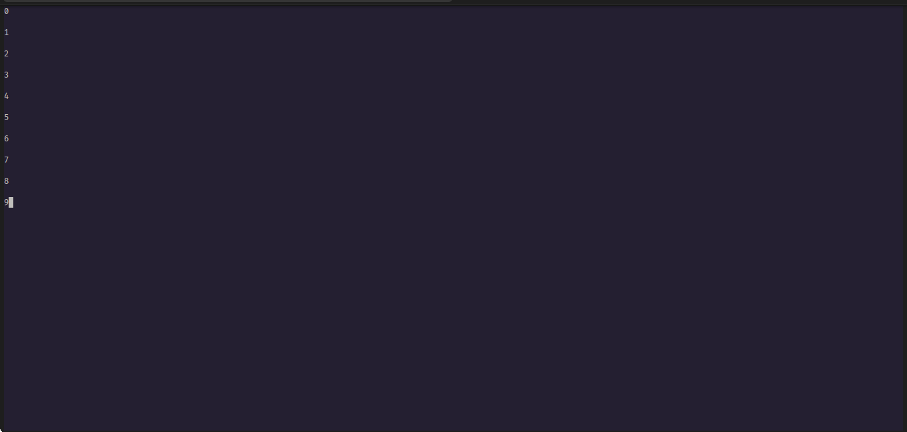

# Xtui

- A python tui library formed on top of curses.
- This library is still under heavy development.
- Given below example uses a Vertical Stack Container to show a list of strings. Then the stack is set as the child for the window. Finally the window is displayed.
```python
from xtui.containers import VStack
from xtui.window import Window


stack = VStack(spacing=1)
stack.bind_model([str(i) for i in range(0, 10)])
Window(stack).present() 
```
